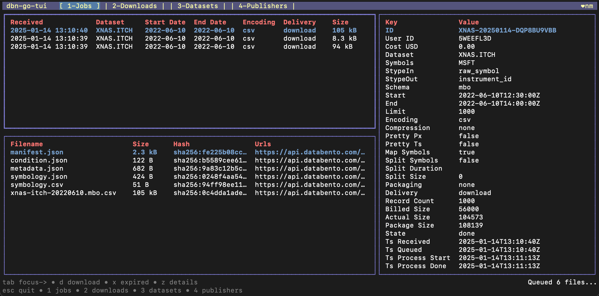
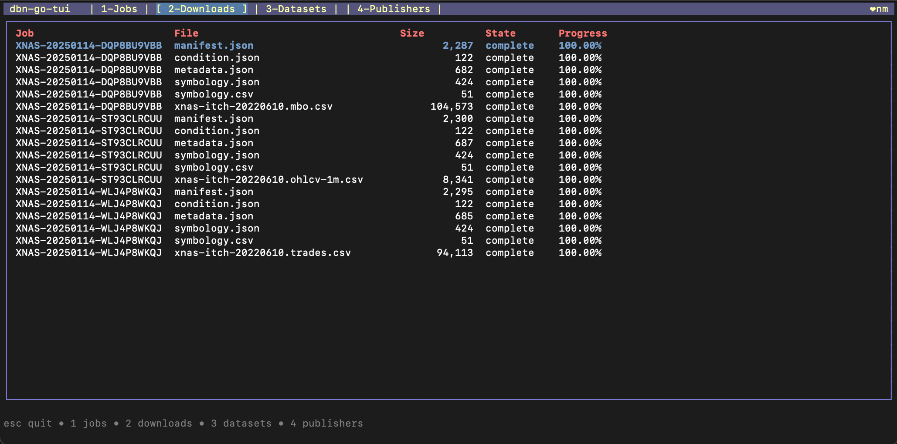
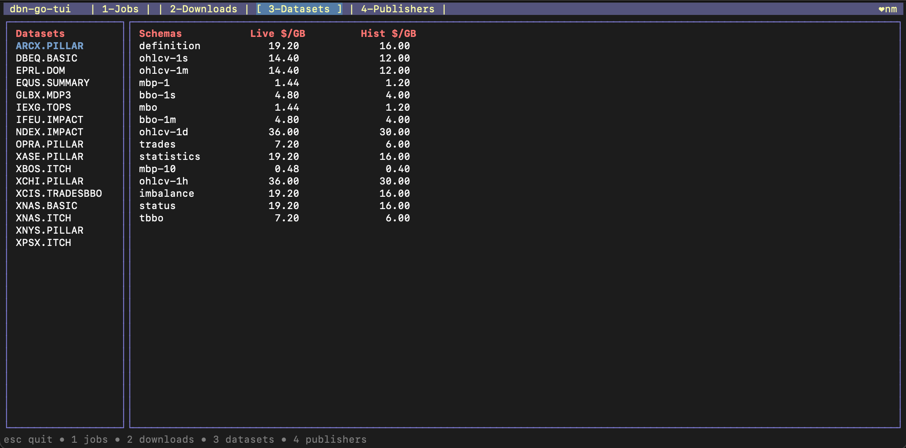
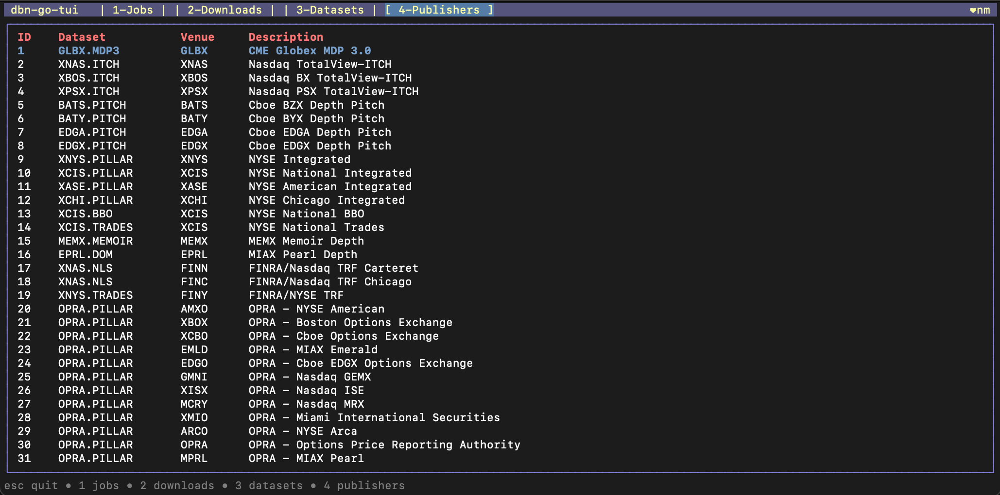

# `dbn-go` Tools

This directory contains command-line tools that use the `dbn-go` library to interact with the Databento API.

It includes:
 * [`dbn-go-file`](#dbn-go-file): a CLI to process DBN files
 * [`dbn-go-hist`](#dbn-go-hist): a CLI to use the Historical API
 * [`dbn-go-live`](#dbn-go-live): a simple Live API feed handler
 * [`dbn-go-mcp`](#dbn-go-mcp): a LLM Model Context Protocol (MCP) server
 * [`dbn-go-tui`](#dbn-go-tui): a TUI for your Databento account

----

## Installation

These tools are available as:

 * Binaries from the [`dbn-go` releases page](https://github.com/NimbleMarkets/dbn-go/releases)

 * Homebrew packages via:
   * `brew install NimbleMarkets/homebrew-tap/dbn-go`

 * Docker multi-architecture images on [GitHub's Container Registry](https://github.com/NimbleMarkets/dbn-go/pkgs/container/dbn-go) at `ghcr.io/nimblemarkets/dbn-go`: 
   * Hist query: `docker run -e DATABENTO_API_KEY --rm ghcr.io/nimblemarkets/dbn-go:0.0.12 /usr/local/bin/dbn-go-hist datasets` 
   * Simple Live feed handler: `docker run -e DATABENTO_API_KEY -v ${pwd}/dbn --rm ghcr.io/nimblemarkets/dbn-go:0.0.12 /usr/local/bin/dbn-go-live -d DBEQ.MINI -s ohlcv-1h -o /dbn/foo.dbn -v -t QQQ SPY`

 * Built-from-source to the `./bin` folder with the command `task go-build` (install [Taskfile](https://taskfile.dev)).  

----

## `dbn-go-file`

`dbn-go-file` is a command-line tool to process DBN files.  You can see an example of exercising it in [this script file](../tests/exercise_dbn-go-file.sh).

```
$ dbn-go-file --help

dbn-go-file processes Databento DBN files

Usage:
  dbn-go-file [command]

Available Commands:
  completion  Generate the autocompletion script for the specified shell
  help        Help about any command
  json        Prints the specified files' records as JSON
  metadata    Prints the specified file's metadata as JSON
  parquet     Writes the specified files' records as parquet
  split       Splits Databento download folders into "<feed>/<instrument_id>/Y/M/D/feed-YMD.type.dbn.zst"

Flags:
  -h, --help      help for dbn-go-file
  -v, --verbose   Verbose output

Use "dbn-go-file [command] --help" for more information about a command.
```


### `dbn-go-file parquet`

`dbn-go-file parquet` is a command to generate [Parquet files](https://parquet.apache.org) from DBN files.  This tools strives to have the same output as the `to_parquet` function [in Databento's Python SDK](https://databento.com/docs/api-reference-historical/helpers/dbn-store-to-parquet?historical=python&live=python&reference=python).  The included simple  [`dbn_to_parquet.py`](./dbn_to_parquet.py) script uses that Python SDK to create tests.

```sh
./dbn_to_parquet.py tests/data/test_data.ohlcv-1s.dbn
parquet-reader tests/data/test_data.ohlcv-1s.dbn.parquet > py.parquet.txt

dbn-go-file parquet tests/data/test_data.ohlcv-1s.dbn
parquet-reader tests/data/test_data.ohlcv-1s.dbn.parquet > go.parquet.txt

diff py.parquet.txt go.parquet.txt
```

Parquet is a common columnar data persistance format.  For example, DuckDB [natively supports](https://duckdb.org/docs/data/parquet/overview.html) Parquet files:

```sh
$ dbn-go-file parquet tests/data/test_data.ohlcv-1s.dbn
$ duckdb mycandles.duckdb
D CREATE TABLE mycandles AS SELECT * FROM './tests/data/test_data.ohlcv-1s.dbn.parquet';
D SELECT * FROM mycandles;
┌───────┬──────────────┬───────────────┬──────────┬──────────┬──────────┬──────────┬────────┬─────────┬──────────────────────────┐
│ rtype │ publisher_id │ instrument_id │   open   │   high   │   low    │  close   │ volume │ symbol  │         ts_event         │
│ uint8 │    uint16    │    uint32     │  double  │  double  │  double  │  double  │ uint64 │ varchar │ timestamp with time zone │
├───────┼──────────────┼───────────────┼──────────┼──────────┼──────────┼──────────┼────────┼─────────┼──────────────────────────┤
│    32 │            1 │          5482 │ 372025.0 │ 372050.0 │ 372025.0 │ 372050.0 │     57 │ ESH1    │ 2020-12-28 08:00:00-05   │
│    32 │            1 │          5482 │ 372050.0 │ 372050.0 │ 372050.0 │ 372050.0 │     13 │ ESH1    │ 2020-12-28 08:00:01-05   │
└───────┴──────────────┴───────────────┴──────────┴──────────┴──────────┴──────────┴────────┴─────────┴──────────────────────────┘
```

### `dbn-go-file split`

`dbn-go-file split` is a command to split Databento download folders into a more manageable structure.  It will create a directory structure like `<feed>/<instrument_id>/Y/M/D/feed-YMD.type.dbn.zst`.   You can pass it a list of files and it will organize them into the appropriate directories.  Here's an example running it on the test data directory:

```sh
dbn-go-file split -v --dest tests/split ./tests/data/*.dbn
writing to 'tests/split/XNAS.ITCH/MSFT/2021/10/04/MSFT.20211004.definition.dbn.zst'
writing to 'tests/split/XNAS.ITCH/MSFT/2021/10/05/MSFT.20211005.definition.dbn.zst'
writing to 'tests/split/GLBX.MDP3/ESH1/2020/12/28/ESH1.20201228.ohlcv-1s.dbn.zst'
writing to 'tests/split/GLBX.MDP3/ESH1/2020/12/28/ESH1.20201228.ohlcv-1s.dbn.zst'
```

----

## `dbn-go-hist`

`dbn-go-hist` is a command-line tool to interact with the Databento Historical API.  You can see an example of exercising it in [this script file](../tests/exercise_dbn-go-hist.sh).  It requires your [Databento API Key](https://databento.com/portal/keys) to be set with `--key` or preferably via the `DATABENTO_API_KEY` environment variable.

*CAUTION: This program may incur billing!*

```
$ dbn-go-hist --help
dbn-go-hist queries the Databento Historical API.

Usage:
  dbn-go-hist [command]

Available Commands:
  completion        Generate the autocompletion script for the specified shell
  cost              Queries Databento Hist for the cost and size of a GetRange query
  dataset-condition Queries Databento Hist for condition of a dataset
  dataset-range     Queries Databento Hist for date range of a dataset
  datasets          Queries Databento Hist for datasets and prints them
  fields            Queries Databento Hist for fields of a schema/encoding and prints them
  files             Lists files for the given Databento Hist JobID
  get-range         Download a range of data from the Hist API
  help              Help about any command
  jobs              Lists Databento Hist jobs
  publishers        Queries Databento Hist for publishers and prints them
  resolve           Resolve symbols via the Databento Symbology API
  schemas           Queries Databento Hist for publishers and prints them
  submit-job        Submit a data request job to the Hist API
  tui               dbn-go-hist TUI
  unit-prices       Queries Databento Hist for unit prices of a dataset

Flags:
  -h, --help         help for dbn-go-hist
  -k, --key string   Databento API key (or use DATABENT_API_KEY envvar)

Use "dbn-go-hist [command] --help" for more information about a command.
```

Simple invocation:

```sh 
$ dbn-go-hist datasets
ARCX.PILLAR
DBEQ.BASIC
EPRL.DOM
EQUS.MINI
EQUS.SUMMARY
GLBX.MDP3
IEXG.TOPS
IFEU.IMPACT
MEMX.MEMOIR
NDEX.IMPACT
OPRA.PILLAR
XASE.PILLAR
XBOS.ITCH
XCHI.PILLAR
XCIS.TRADESBBO
XNAS.BASIC
XNAS.ITCH
XNYS.PILLAR
XPSX.ITCH

$ dbn-go-hist schemas -d DBEQ.MINI --json
["mbo","mbp-1","mbp-10","tbbo","trades","ohlcv-1s","ohlcv-1m","ohlcv-1h","ohlcv-1d","definition","status"]
```

----

## `dbn-go-live`

`dbn-go-live` is a command-line tool to subscribe to a Live Databento stream and write it to a file.   It requires your [Databento API Key](https://databento.com/portal/keys) to be set with `--key` or preferably via the `DATABENTO_API_KEY` environment variable.

*CAUTION: This program incurs billing!*

```
$ dbn-go-live --help
usage: dbn-go-live -d <dataset> -s <schema> [opts] symbol1 symbol2 ...

  -d, --dataset string          Dataset to subscribe to 
  -e, --encoding dbn.Encoding   Encoding of the output ('dbn', 'csv', 'json') (default dbn)
  -h, --help                    Show help
  -k, --key string              Databento API key (or set 'DATABENTO_API_KEY' envvar)
  -o, --out string              Output filename for DBN stream ('-' for stdout)
  -s, --schema stringArray      Schema to subscribe to (multiple allowed)
  -i, --sin dbn.SType           Input SType of the symbols. One of instrument_id, id, instr, raw_symbol, raw, smart, continuous, parent, nasdaq, cms (default raw_symbol)
  -t, --start string            Start time to request as ISO 8601 format (default: now)
  -v, --verbose                 Verbose logging
```

Simple invocation:
```
$ dbn-go-live -d DBEQ.MINI -s ohlcv-1h -o foo.dbn -v -t QQQ SPY 
```

Simple Docker invocation:

```
$ docker run -it --rm \
    -e DATABENTO_API_KEY \
    -v ${pwd}/dbn \
    ghcr.io/nimblemarkets/dbn-go:0.0.11 \
    /usr/local/bin/dbn-go-live -d DBEQ.MINI -s ohlcv-1h -o /dbn/foo.dbn -v -t QQQ SPY 
```

----

## `dbn-go-mcp`

`dbn-go-mcp` is a [Model Context Protocol (MCP)](https://www.anthropic.com/news/model-context-protocol) for Databento services.  This allows tools like [Claude Desktop](https://claude.ai/download) to query Databento in LLM tasks. 

This tool has [it's own README](./dbn-go-mcp/README.md) which describes it and explores some usage.

----

## `dbn-go-tui`

`dbn-go-tui` is a terminal user interface for your Databento account.  It requires your [Databento API Key](https://databento.com/portal/keys) to be set with `--key` or preferably via the `DATABENTO_API_KEY` environment variable.  The TUI may also be invoked via `dbn-go-hist tui`.

```
$ export DATABENTO_API_KEY=<your key>
$ dbn-go-tui --help

usage: ./bin/dbn-go-tui [options]

  -h, --help         Show help
  -k, --key string   Databento API key (or set 'DATABENTO_API_KEY' envvar)
  -l, --limit int    Limit maximum concurrent downloads (default 4)
  
$ dbn-go-tui
```

It has four main pages.  See the bottom of each page for key bindings.

| <!-- --> | <!-- --> |
|----------|----------|
| **Jobs** | List your batch jobs and their files, then download them |
| **Downloads** | Status of the Downloads from the Jobs page |
| **Datasets** | List datasets, their schemas, and costs |
| **Publishers** | List publishers and their datasets |

Currently, downloads are placed in the current working directory.

Here are some screenshots of each TUI page:

<p><b>Jobs</b><br>

</p>

<p><b>Downloads</b><br>
</p>

<p><b>Datasets</b><br>
</p>

<p><b>Publishers</b><br>
</p>

